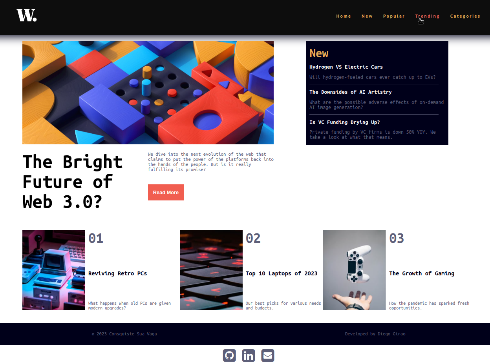

# Frontend Mentor Challenge - Diego News homepage solution

Esse template foi utilizado para a criação do Primeiro Projeto da mentoria **Conquiste Sua Vaga** , para que assim pudesse ser exercitado algumas habilidades de Frontend e assim poder melhorar a base de conhecimento e evoluir de forma consistente e continua.

## Sumário

- [Overview](#overview)
  - [O Desafio](#O-Desafio)
  - [Screenshot](#screenshot)
- [Meu processo](#Meu-processo)
  - [Stacks utilizadas](#Stacks-utilizadas)
  - [O que aprendi](#O-que-aprendi)
  - [Desenvolvimento Contínuo](#Desenvolvimento-Contínuo)
- [Author](#author)
- [Agradecimentos](#Agradecimentos)

## Overview

### O Desafio

Usuários devem conseguir:

- Ver o layout ideal para a interface, dependendo do tamanho da tela do dispositivo
- Ver o hover e focus para todos os elementos interativos na página

### Screenshot

## Meu processo

- Selecionar o projeto a ser realizado

- Após selecionar o projeto, optei por utilizar apenas _HTML5, CSS e JavaScript_, para particar ainda mais sem o uso de frameworks/libs, melhorando assim ainda mais a base de conhecimento

- Foi realizado alguns esboços em papel de como seria a estrutura do projeto

- Iniciado o desenvolvimento do código

### Stacks utilizadas

- [x] HTML5 Semântico
- [x] CSS puro
- [x] Flexbox
- [x] CSS Grid
- [x] JavaScript

### O que aprendi

- Aprendi uma nova forma de implementar um "Menu hamburguer" para a versão responsiva/mobile

- Que de fato preciso melhorar na parte de CSS puro, pois não utilizava a algum tempo

- Uma grande melhoria na gestão desse projeto ao utilizar o método pomodoro

- _Voltar as raizes é sempre bom_, pois ao utilizar apenas frameworks/libs acaba e etc... para otimizar o desenvolvimentos, alguns conceitos acabam esquecidos

### Desenvolvimento Contínuo

Algumas melhorias já estão mapeadas para próxima release, são as seguintes:

- [ ] Migrar para um Framework - Em análise
- [ ] Utilizar pré processadores CSS - Em análise
- [ ] Integração com uma API de notícias - Em análise

## Author

- Github - [Diego Girao](https://github.com/diego-girao)
- Twitter - [@diegoramiro25](https://www.twitter.com/diegoramiro25)

## Agradecimentos

Meu muito obrigado aos mentores **Pedro Marins e Henrique Andrade**, assim como os tutores e meus colegas da turma 23c e da comunidade **Code** no geral, vocês são excelentes e estão sempre aptos a ajudar, parabéns a todos os envolvidos.
